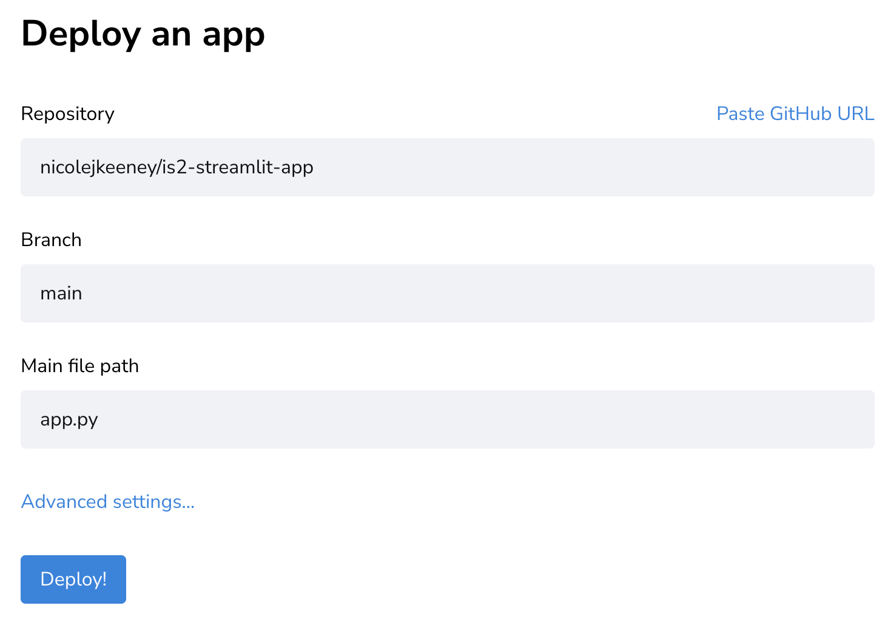
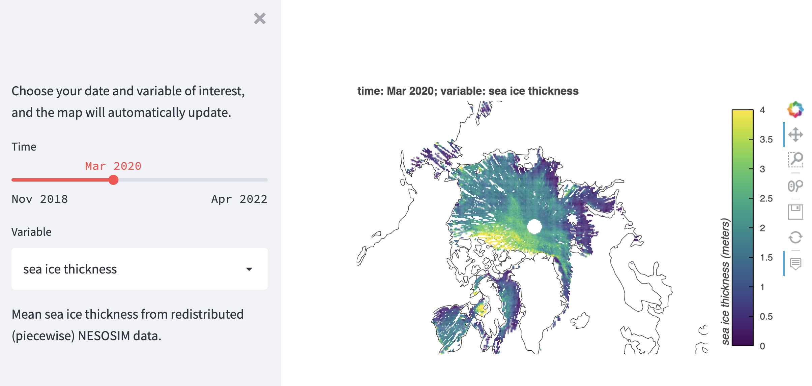
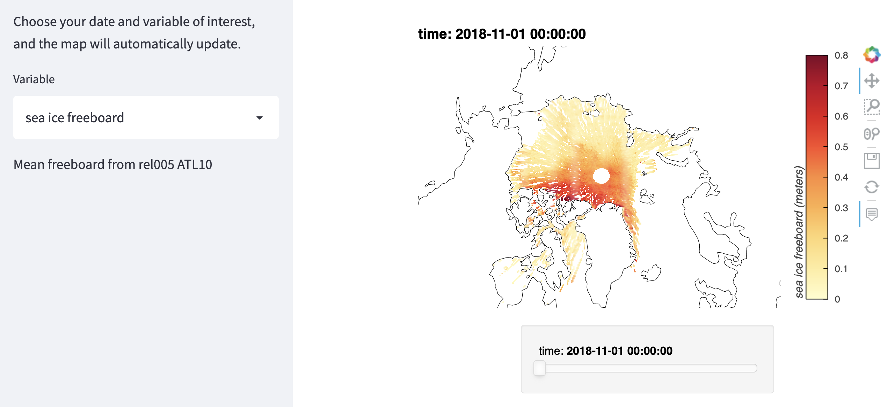

# ICESat-2 sea ice thickness data dashboard 

This repository contains code and files for building a streamlit application to visualize ICESat-2 sea ice gridded data. It reads in the data as zarr files from an S3 bucket, then produces a map with user options, all within the streamlit framework. I tried to document this as best as a could but please feel free to reach out if you need any help deciphering the code!

## Deploying the app on Streamlit.io 

1) I think you need to be an owner of the repository to build it on Streamlit's cloud, so you will need to fork the repo.
2) Create an account on [Streamlit.io](https://streamlit.io/)
3) Deploy the app. You'll need to choose app.py as the application you want to built 
4) Voila! You're app should be up and running.



**A note:** Streamlit will "put your app to sleep" after a certain amount of time (maybe 1 week?) if no one has opened it. Then it will rebuilt the entire app the next time the web page is opened. Very annoying!

## The two files: app.py and app_html.py 
These are both streamlit applications that serve the same purpose through different methods. They utilize the same helper functions in the utils folder. Between the two, my preference is for app.py.

### app.py
This application uses **streamlit's native widgets** (sliders and dropdowns) to display the user options, and outputs a map that is rendered using **bokeh**. This app has better functionality with streamlit, I think, and can be more easily scaled to improve performace. The bottleneck with speed for this app appears to be streamlit's resources; when running this locally, it's quite fast, but when running it in streamlit's cloud, it's obnoxiously slow. If you could connect to AWS's compute resources, this could maybe run quite fast as a web app. 




### app_html.py 
This application uses **bokeh's widgets** (sliders and dropdowns) to display the user options, and outputs a map that is rendered using **html**. This app takes forever to load, because all the options are pre-loaded before they are displayed-- meaning, all variable options AND timesteps! Because of this, in the code you'll see I've only included a small subset of variable and time options. Within the app, the map is outputted to html, then just kind of shoved into streamlit's framework to display it. I think this also (negatively) impacts performance. But, it sure looks nice once it's all loaded! 




## The computational environment 
At the time of writing (Jan 2023), Streamlit was unable to build my conda environment. To skirt around this, I created a requirements.txt file with the necessary pip requirements, accompanied by a packages.txt file with the required libgeos dependency (needed for installing cartopy using pip). **For this repository, I've included both a conda environment.yml file and the pip requirements.txt file.** The conda file is useful for developing locally but cannot be used by streamlit, which needs both the requirements.txt and packages.txt file to sucessfully build the app environment. 

**Streamlit will automatically build the pip environment from the requirements.txt and packages.txt files in your repository.** However, if you want to build either of these environments locally, I've included instructions below. 

### How to build the conda environment locally
To create the environment, run the following in the command line: 
```
conda env create -f conda_env/conda_env.yml
```
To activate the environment, run the following in the command line: 
```
conda activate icesat2_dashboard
```

### How to build the pip environment locally
I have a Mac. I'm unsure if these instructions would work on other OS (I assume not). I found creating a virtual environment with pip to be much more challenging than using conda, but I was able to successfully set it up this way: 
1) Install pipenv. Needed to install this globally using this in terminal (following instructions from [this](https://stackoverflow.com/questions/46391721/pipenv-command-not-found) stackoverflow post): 
`sudo -H pip install -U pipenv`
2) In the icesat2-dashboard directory, I ran `pipenv install requests` followed by `pip install virtualenv`, following the instructions from [this article](https://docs.python-guide.org/dev/virtualenvs/)
3) Create new virtual env for project (in project directory): `virtualenv venv`
4) Activate environment: `source venv/bin/activate`
5) Install packages from requirements.txt: `python3 -m pip install -r requirements.txt`

Anytime you want to activate the environment, just run step 4 in your terminal. 


